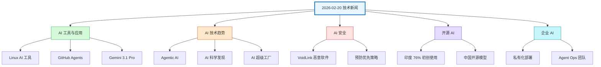
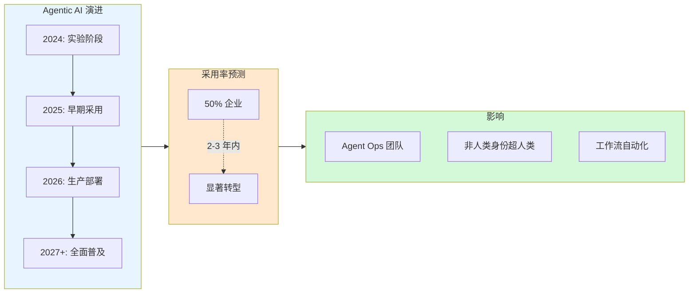
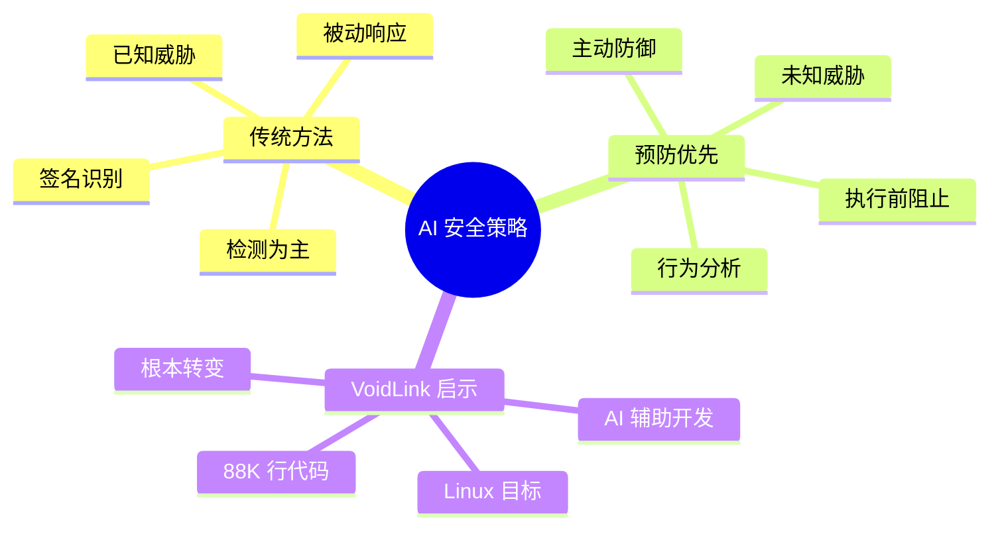
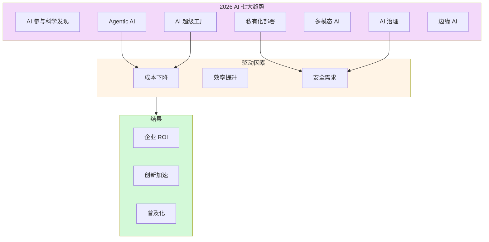
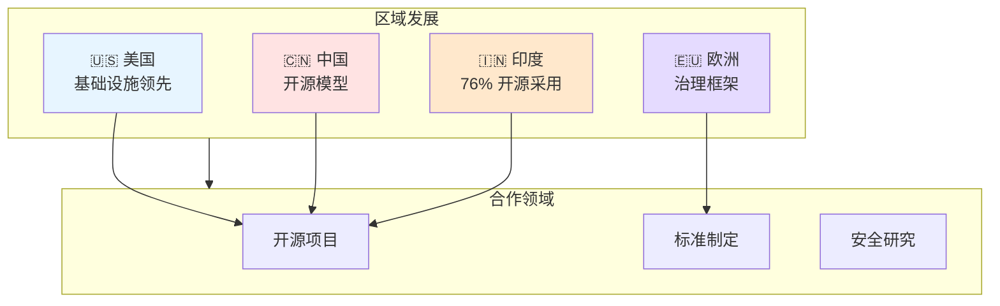

# 2026-02-20 技术新闻分类图

使用 Mermaid 可视化今日新闻的主题分布和关联关系。

## 📊 新闻主题流程图

## 🔄 Agentic AI 发展流程

## 🛡️ AI 安全防御策略对比

## 📈 2026 AI 趋势关联图

## 🌍 全球 AI 发展格局

---

## 📝 图表说明

1. **新闻主题流程图** - 展示今日新闻的 6 大主题分类
2. **Agentic AI 演进** - 从实验到普及的发展路径
3. **AI 安全策略** - 传统检测 vs 预防优先
4. **趋势关联图** - 7 大趋势与驱动因素的关系
5. **全球格局** - 主要地区的 AI 发展重点

---

_生成时间：2026-02-20 10:52 · OpenClaw Mermaid Visualizer_
