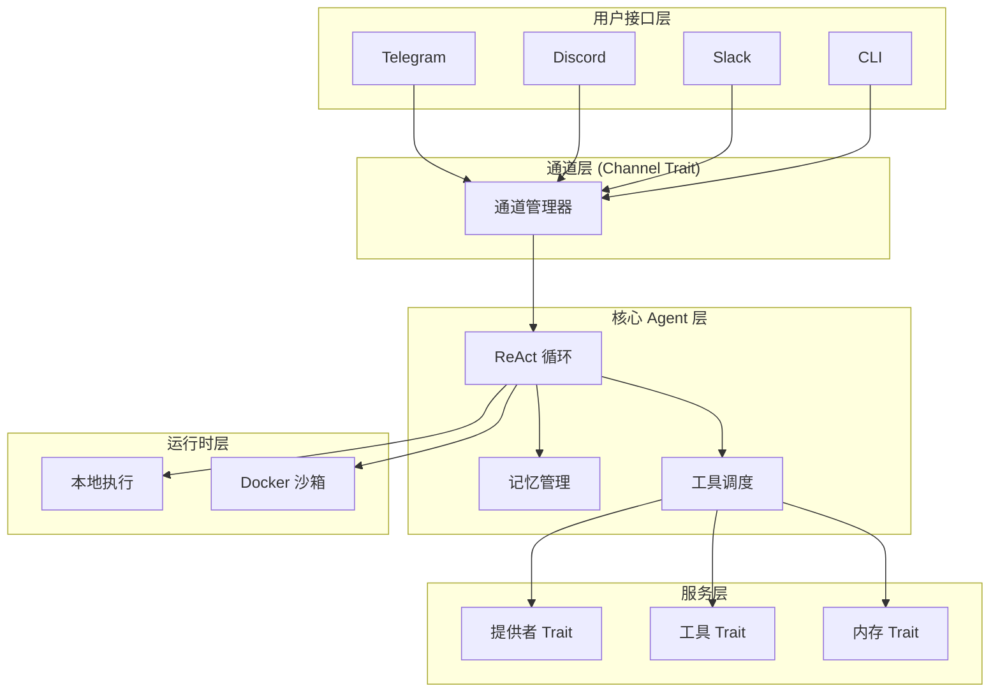
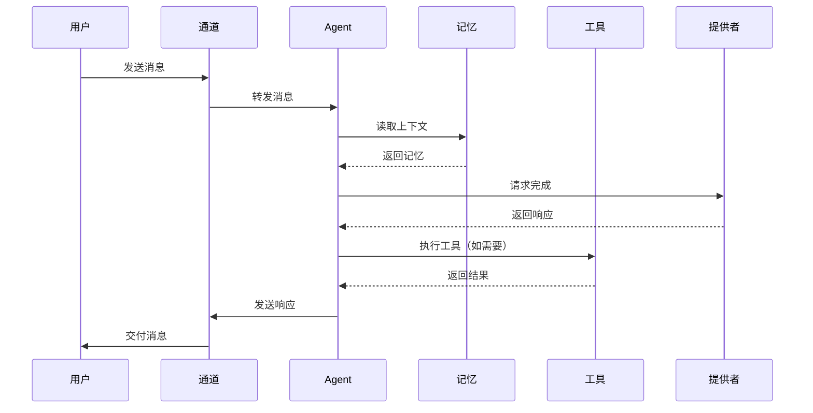

# ZeroClaw-架构设计

> [!summary] 核心概念
> ZeroClaw 采用 Trait 驱动的架构设计，所有核心系统（提供者、通道、工具、内存、隧道）都通过 Rust traits 实现，支持完全可插拔和热替换。

## 核心设计理念

### 1. Trait 驱动架构

ZeroClaw 的核心系统全部通过 Rust traits 定义接口：

```rust
// 提供者 trait（模型 API）
pub trait Provider: Send + Sync {
    fn complete(&self, request: CompletionRequest) -> Result<CompletionResponse>;
    fn name(&self) -> &str;
}

// 通道 trait（消息通道）
pub trait Channel: Send + Sync {
    fn send(&self, message: Message) -> Result<()>;
    fn receive(&self) -> Result<MessageStream>;
}

// 工具 trait（功能扩展）
pub trait Tool: Send + Sync {
    fn execute(&self, input: ToolInput) -> Result<ToolOutput>;
    fn schema(&self) -> ToolSchema;
}
```

### 2. 完全可插拔

所有组件都可以热替换：

- **提供者**：OpenAI、Anthropic、本地模型（Ollama 等）
- **通道**：Telegram、Discord、Slack、Matrix
- **工具**：文件系统、Shell、网络、自定义工具
- **内存**：本地文件、远程数据库、向量存储
- **运行时**：本地执行、Docker 沙箱

### 3. 安全默认

- **配对机制**：新设备需要显式授权
- **严格沙箱**：Docker 运行时隔离
- **显式允许列表**：只有授权用户可访问
- **工作域隔离**：每个项目独立配置

## 架构层次



## 核心组件

### 1. 提供者（Provider）

负责与 AI 模型 API 通信：

| 提供者 | 状态 | 认证方式 |
|--------|------|----------|
| OpenAI | ✅ | API Key |
| Anthropic | ✅ | API Key / OAuth |
| OpenRouter | ✅ | API Key |
| Ollama | ✅ | 本地 |
| LM Studio | ✅ | 本地 |

**配置示例：**

```toml
# ~/.zeroclaw/config.toml
[provider]
kind = "openai"
api_key = "sk-..."
model = "gpt-4o"
```

### 2. 通道（Channel）

负责与用户通信：

| 通道 | 状态 | 配置复杂度 |
|------|------|------------|
| Telegram | ✅ | 简单 |
| Discord | ✅ | 中等 |
| Slack | ✅ | 中等 |
| Matrix | 🚧 | 复杂 |

**配置示例：**

```toml
[channel.telegram]
enabled = true
bot_token = "..."
allowed_users = ["123456789"]
```

### 3. 工具（Tool）

提供 Agent 可执行的功能：

**内置工具：**
- `shell` - 执行 Shell 命令
- `file_read` - 读取文件
- `file_write` - 写入文件
- `web_search` - 网络搜索
- `web_fetch` - 获取网页内容

**自定义工具：**

```rust
pub struct MyCustomTool;

impl Tool for MyCustomTool {
    fn execute(&self, input: ToolInput) -> Result<ToolOutput> {
        // 自定义逻辑
    }
    
    fn schema(&self) -> ToolSchema {
        ToolSchema {
            name: "my_tool".to_string(),
            description: "Does something useful".to_string(),
            // ...
        }
    }
}
```

### 4. 内存（Memory）

管理 Agent 的持久化状态：

| 类型 | 描述 |
|------|------|
| 短期记忆 | 当前会话上下文 |
| 长期记忆 | MEMORY.md 等持久文件 |
| 向量记忆 | 语义搜索（可选） |

### 5. 运行时（Runtime）

控制代码执行环境：

| 模式 | 描述 | 安全性 |
|------|------|--------|
| `local` | 本地直接执行 | 中 |
| `docker` | Docker 容器隔离 | 高 |
| `none` | 禁用工具执行 | 最高 |

## 数据流



## 配置文件结构

```toml
# ~/.zeroclaw/config.toml

# 提供者配置
[provider]
kind = "anthropic"
api_key = "..."
model = "claude-sonnet-4-5-20250929"

# 通道配置
[channel.telegram]
enabled = true
bot_token = "..."
allowed_users = ["user_id_1", "user_id_2"]

# 运行时配置
[runtime]
kind = "docker"
workdir = "/workspace"

# 内存配置
[memory]
path = "~/.zeroclaw/memory"
vector_store = false

# 日志配置
[logging]
level = "info"
file = "~/.zeroclaw/zeroclaw.log"
```

## 扩展机制

### 添加自定义提供者

1. 实现 `Provider` trait
2. 在配置中注册
3. 通过 `--provider` 参数使用

### 添加自定义工具

1. 实现 `Tool` trait
2. 定义工具 schema
3. 注册到工具注册表

### 添加自定义通道

1. 实现 `Channel` trait
2. 处理消息收发
3. 配置通道参数

## 与 OpenClaw 架构对比

| 特性 | OpenClaw | ZeroClaw |
|------|----------|----------|
| 架构 | 插件系统 | Trait 驱动 |
| 扩展语言 | TypeScript | Rust |
| 热重载 | 支持 | 需重新编译 |
| 类型安全 | 动态 | 静态 |
| 性能 | 中等 | 极高 |

## 下一步

- [[ZeroClaw-认证机制]] - 配置认证和授权
- [[ZeroClaw-提供者配置]] - 配置 AI 模型提供者
- [[ZeroClaw-沙箱运行时]] - Docker 沙箱配置

---

_最后更新：2026-02-21_
