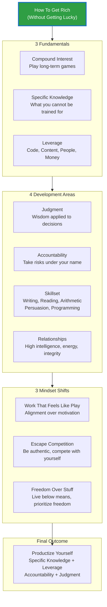

## Naval's 10 Key Principles (视觉化总结)

**三大基础**
- **复利效应**: 选择值得长期投入的行业，与长期伙伴合作
- **专属知识**: 追随天赋、热情和好奇心，做别人无法替代的事
- **杠杆力量**: 代码和内容是最好的杠杆（无需许可即可使用）

**四项修炼**
- **判断力**: 杠杆放大决策后果，方向比速度更重要
- **责任担当**: 以自己的名义承担风险，建立声誉
- **核心技能**: 写作、阅读、算术、说服力、编程
- **正确伙伴**: 选择高智商、高能量、高诚信的人合作

**三大思维转变**
- **工作即游戏**: 找到让你感觉像玩、别人看着像工作的事业
- **跳出竞争**: 通过真实做自己来避开竞争
- **追求自由**: 金钱是工具，自由才是目标（时间、工作、地点、日程的自主权）

**最终公式**: 产品化自己 = 专属知识 × 杠杆 × 责任 × 判断力
