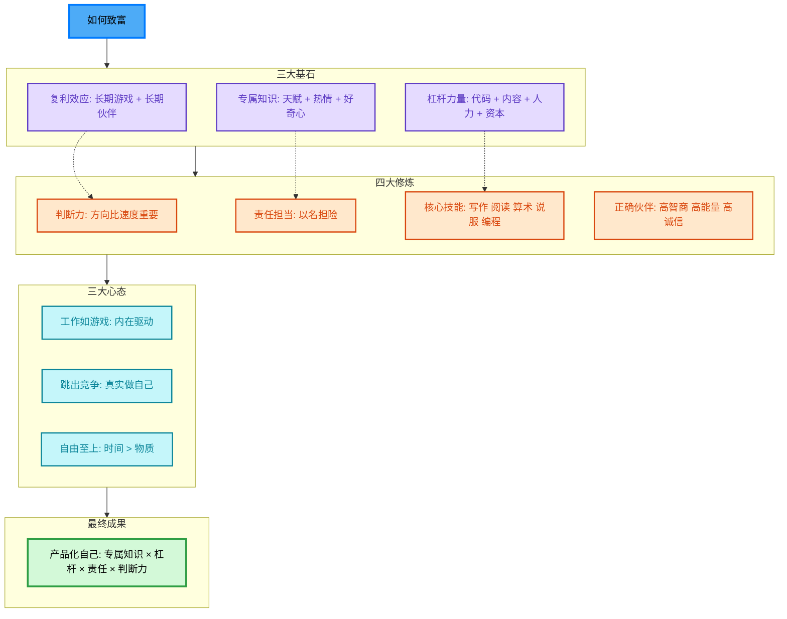

# 🎯 如何致富（不靠运气）- Naval 的 10 个核心原则

## 📊 完整可视化

---

## 📖 详细解读

### 💡 三大基石

#### 1. 复利效应
- **核心思想**: 人生所有回报（财富、关系、知识）都来自复利
- **实践方法**:
  - 选择值得长期投入的行业
  - 与长期伙伴合作
  - 耐心等待，不要频繁更换方向

#### 2. 专属知识
- **定义**: 社会想要但不知道如何获得的知识，无法被培训
- **特点**:
  - 高度专业化或创造性
  - 无法外包或自动化
  - 追随天赋、热情、好奇心
- **开发方法**:
  - 分析技能 → 组合技能 → 追随好奇 → 观察行动 → 强化优势

#### 3. 杠杆力量
- **类型**:
  - **人力杠杆**: 他人替你工作
  - **资本杠杆**: 金钱替你工作
  - **内容杠杆**: 媒体替你工作
  - **代码杠杆**: 软件替你工作
- **构建方式**:
  - 选择细分领域
  - 解决问题
  - 每日发布内容
  - 提供免费价值
  - 建立邮件列表

---

### 🔧 四大修炼

#### 4. 判断力
- **定义**: 将智慧应用于外部问题
- **重要性**: 杠杆放大决策后果，方向比速度更重要
- **提升方法**:
  - 简化生活
  - 收集心智模型
  - 控制情绪
  - 关注长期后果
  - 追问第一性原理

#### 5. 责任担当
- **核心**: 以自己的名义承担商业风险
- **好处**: 社会以责任、股权、杠杆作为回报
- **心态**: 失败得到批评，成功得到赞誉

#### 6. 核心技能
- **五大技能**:
  1. **写作** - 一切内容的基础
  2. **阅读** - 持续学习
  3. **算术** - 
</think>

我创建一个简化版本，避免特殊字符问题：.